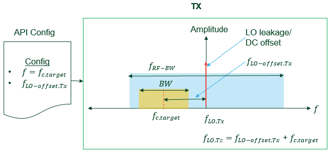

# NI RF Data Recording API v1.1.0

Welcome to RF Data Recording API! The RF Data Recording API is the free and open-source Python-based API to record Real-World RF data sets in an easy and automated way.

The recorded data sets are saved in [Signal Metadata Format (SigMF) format](https://github.com/gnuradio/SigMF). SigMF is an open-source standard that specifies a way to describe sets of recorded digital signal samples with metadata (data properties & scenario descriptions) provided in [JSON](http://www.json.org/) files, which are human-readable and easily portable into various software environments. This allows to use the recorded data sets for various research and application areas including research on AI/ML for 6G wireless communications.  

The RF Data Recording API has been built based on [UHD](https://github.com/EttusResearch/uhd). UHD is the free & open-source software driver and API for the [Universal Software Radio Peripheral (USRP™) SDR](https://www.ettus.com/products/) platform.

---

## Table of Contents
<!-- AUTO-GENERATED-CONTENT:START (TOC:collapse=true&collapseText="Click to expand") -->
<details>
<summary>"Click to expand"</summary>

- [NI RF Data Recording API v1.1.0](#ni-rf-data-recording-api-v110)
  - [Table of Contents](#table-of-contents)
  - [Introduction](#introduction)
  - [API Features](#api-features)
  - [System Requirements](#system-requirements)
    - [Software](#software)
    - [Hardware](#hardware)
      - [mmWave Solution](#mmwave-solution)
  - [Reference Architecture](#reference-architecture)
  - [API Components](#api-components)
    - [Main Scripts for API Execution](#main-scripts-for-api-execution)
    - [Waveforms](#waveforms)
    - [Configuration Files](#configuration-files)
    - [Wireless Link Parameter Map Dictionary](#wireless-link-parameter-map-dictionary)
    - [API Library](#api-library)
  - [System Setup](#system-setup)
  - [How to Run NI RF Data Recording API](#how-to-run-ni-rf-data-recording-api)
    - [Pre-requisite for mmWave Support](#pre-requisite-for-mmwave-support)
      - [Get the Driver API of mmWave Devices](#get-the-driver-api-of-mmwave-devices)
      - [Get Necessary Inputs](#get-necessary-inputs)
      - [Get Value Limits of Configurations for the Beam Former](#get-value-limits-of-configurations-for-the-beam-former)
    - [Running RF Data Recording API based on Configuration File](#running-rf-data-recording-api-based-on-configuration-file)
    - [RF Replay Data Transmitter](#rf-replay-data-transmitter)
    - [RF Rx Data Recorder](#rf-rx-data-recorder)
    - [LO Configuration](#lo-configuration)
    - [Results](#results)
    - [RF Data Pre-Processing](#rf-data-pre-processing)
  - [Directories](#directories)
  - [Contributing](#contributing)
  - [Known Issues and Limitations](#known-issues-and-limitations)
  - [Acknowledgment](#acknowledgment)

</details>
<!-- AUTO-GENERATED-CONTENT:END -->

---

## Introduction
Future wireless communication systems (e.g., 6G cellular communication systems) are expected to use more and more artificial intelligence and machine learning (AI/ML) principles. The underlying AI/ML algorithms have to get trained to serve specific purposes. They require large data sets to get trained to a wide variety of potential scenarios and the performance depends on the quality and representability of the data sets.

As a result, RF data sets play a pivotal role in training and testing AI/ML models for different wireless applications. However, different researchers use different channel models and ray-tracing applications that generate data sets for their specific scenarios to test and validate their AI/ML models. Typically, these data sets are stored in heterogeneous formats and with different kind and completeness of metadata (scenario descriptions). This makes it quite difficult to generalize and to compare the AI/ML models and to adopt the data sets by the broader research community.

Another important aspect is the augmentation of the AI/ML model training and validation with real-world RF date sets. This can ultimately improve the robustness of the trained AI/ML algorithms in practical environments since these data sets include additional effects like RF impairments and real-world channel properties which are not covered by simulation environments.

Despite being in the early phase of research for 6G, AI & ML appears to be becoming one of the defining technologies for future wireless networks. The RF Data Recording API is designed by [NI](https://www.ni.com/) in collaboration with [Northeastern University](https://coe.northeastern.edu/) to generate real-world data sets which could be critical in determining how the algorithms perform in the real world. It provides comprehensive scenario descriptions by means of the JSON-based SigMF metadata files, which are human readable and easy to parse. This will simplify the management of data set libraries and the adoption by other researchers.

---

## API Features
- Interface NI’s USRP SDR platform via UHD driver and Python software platforms.
- Support mmWave devices via the related official driver and Python software platforms.
- Facilitate hassle-free setup of NI’s SDR platform for experimentation and data sets collection.
- Highly configurable as it requires a single configuration file for setting the desired values of parameters of multiple connected SDRs for the required data recording campaign.
- [JSON](http://www.json.org/) Or [YAML](https://yaml.org/) based configuration of data recording campaign. 
- Scalable number of Tx and Rx stations with individual parameter configuration (e.g. frequency, bandwidths, Tx/Rx gains, Tx LO …).
- Definition of parameter settings as single, list or range of values.
- Continuous waveform playback for each Tx with individual waveforms in [TDMS](https://www.ni.com/en-ca/support/documentation/supplemental/06/the-ni-tdms-file-format.html) or MATLAB format (e.g.  5G NR, LTE, Radar, WiFi). 
- Configurable number of data recordings per configuration point.
- Instant conversion of recorded IQ data to [SigMF format](https://github.com/gnuradio/SigMF) proposed by OS group as standard for RF AI/ML data sets.
- SigMF metadata includes individual information of each active Tx and RF configuration.
- Several operation modes to use single or multiple host machines.

---

## System Requirements

### Software
Ubuntu 20.04 is used in our test environment. However, you can build UHD on different operating systems. Look to [Building and Installing the USRP Open-Source Toolchain (UHD and GNU Radio) on Linux - Ettus Knowledge Base](https://kb.ettus.com/Building_and_Installing_the_USRP_Open-Source_Toolchain_(UHD_and_GNU_Radio)_on_Linux).

### Hardware
To use the NI RF Data Recording API, you need at least one NI RF USRP device (for Tx or Rx only operation mode). The API has been tested on both [NI USRP X310](https://www.ettus.com/all-products/x310-kit/) ([X300/X310 Getting Started Guides](https://kb.ettus.com/X300/X310_Getting_Started_Guides)) and [NI USRP X410](https://www.ettus.com/all-products/usrp-x410/) ([X410 Getting Started Guides](https://kb.ettus.com/USRP_X410_Getting_Started_Guide)). The devices should be connected to single or different host computers based on the API operation mode and the investigated application. The following figure shows the setup of three Tx stations and one Rx Station.   


The following table presents the required hardware for this configuration (cabled setup).
| Item    					| Number	| 
| ------------------------- | ----------|
| Host PC (Linux Server)   	| 1 		|
| X310 or X410 USRP Device    		| 4    		| 
| SMA Cable  				| 4 		| 
| 30 dB Attenuator  		| 1    		| 
| 10 Gig Eth Cable (SFP+) *	| 4     	|

***Note1**: The USRP X310 can be connected to the host machine using different options. Look to [Network Connectivity Guide](https://files.ettus.com/manual/page_usrp_x3x0.html#x3x0_getting_started_connectivity).

***Note2**: The USRP X410 can be connected to the host machine using different options. Look to [Network Connectivity Guide](https://files.ettus.com/manual/page_usrp_x4xx.html#x4xx_getting_started_network_connectivity).
- Host PC Linux server: Recommended with [10Gig Eth card (SFP+)](https://www.ettus.com/all-products/10gige-1m/).
- SMA cable: Female/female cable that is included with the USRP RIO device.
- USRP RIO device: USRP-X310, USRP-2940/2942/2943/2944/2950/2952/2953/2954 Software Defined Radio Reconfigurable Devices with 120 MHz or 160 MHz bandwidth and with UHD FPGA images.
- Attenuator with 30 dB attenuation and male/female SMA connectors that are included with the USRP RIO device.

Ensure your host has enough free disk space and RAM. 

- **Caution**: Before using your hardware, read all product documentation to ensure compliance with safety, EMC, and environmental regulations.
- **Caution**: To ensure the specified EMC performance, operate the RF devices only with shielded cables and accessories.
- **Caution**: To ensure the specified EMC performance, the length of all I/O cables except for those connected to the GPS antenna input of the USRP device must be no longer than 3 m (10 ft.).
- **Caution**: The USRP RIO RF devices are not approved or licensed for transmission over the air using an antenna. As a result, operating this product with an antenna may violate local laws. Ensure that you are in compliance with all local laws before operating this product with an antenna.

#### mmWave Solution 
To support mmWave research, mmWave devices are required that include the mmWave beam formers and up/down frequency converters (UDC) either the Dual channel or the Single channel type.

The following figure shows the setup using mmWave devices (two beam formers and one dual channel UDC) of TMYTEK-NI for a single Tx station and Rx station.


The following table presents the required hardware for this configuration.
| Item    					| Number	| 
| ------------------------- | ----------|
| Host PC (Linux Server)   	| 1 		|
| X310 or X410 USRP Device    		| 2    		| 
| SMA Cable  				| 4 		| 
| 10 Gig Eth Cable (SFP+) *	| 2     	|
| 1 Gig Eth Cable	        | 4         |
| Switch	                | 1         |
| BBox One 5G	            | 1     	|
| BBox Lite 5G	            | 1     	|
| UD Box 5G	                | 1     	|

The following figure shows the setup using mmWave devices (two beam formers and two single channel UDC) of TMYTEK-NI for a single Tx station and Rx station.


The following table presents the required hardware for this configuration.
| Item    					| Number	| 
| ------------------------- | ----------|
| Host PC (Linux Server)   	| 1 		|
| X310 or X410 USRP Device    		| 2    		| 
| SMA Cable  				| 4 		| 
| 10 Gig Eth Cable (SFP+) *	| 2     	|
| 1 Gig Eth Cable	        | 5         |
| Switch	                | 1         |
| BBox One 5G	            | 1     	|
| BBox Lite 5G	            | 1     	|
| UD Box 5G	                | 2     	|
***Note**: The "BBox One 5G" and "BBox Lite 5G" is the beam former and "UD Box 5G" is the UDC. [TMYTEK-NI mmWave Device with NI Ettus USRP X410 Getting Started Guide](https://www.ni.com/docs/en-US/bundle/tmytek-ni-mmwave-device-with-ni-ettus-usrp-x410-getting-started/resource/tmytek-ni-mmwave-device-with-ni-ettus-usrp-x410-getting-started.pdf) can provide the reference.

---

## Reference Architecture
By using a few clicks, the RF Data Recording API can generate real-world RF data sets using NI SDR platform at different configurations. Its flexible architecture allows for different recording use cases. Such as any system, the RF Data Recording API has the inputs, the processing unit, and the outputs. Those are:
- **Inputs**: They are three:
    - Configuration file in JSON or YAML format
    - Wireless Link Parameter Map Dictionary (YAML file)
    - Pre-generated waveforms (NR, LTE, Radar, WiFi)
- **Processing unit**: It has two parts:
    - SW: The RF data Recording API code on top of UHD Python API. 
    - HW: Linux Server and NI USRPs
- **Output**: The recorded RF data sets in SigMF format. For each record, there are two files:
    - SigMF Data: Binary file includes collected raw data
    - SigMF Metadata (JSON format)

The following figure shows the reference architecture of NI RF Data Recording API including mmWave solution.


***Note**: The update involves incorporating mmWave devices into the API loop, which are compatible with the existing inputs and outputs of the mmWave solution.

---

## API Components
The main components of the source project are described in the following:

---

### Main Scripts for API Execution
 The main scripts to execute the API are:
- **RF Data Recording API**:  The main Python script for Tx, Rx, or Tx & Rx RF modes is `src/main_rf_data_recording_api.py`. It is configured via configuration files stored in [src/config](src/config).

To run the API in Tx or Rx RF mode only and configure it from the terminal, the following two scripts can be used:
- **RF Replay Data Transmitter**: `src/rf_replay_data_transmitter_usrp_uhd.py`
- **RF Rx Data Recorder**: `src/rf_data_recorder_usrp_uhd.py`

***Note**: The above two scripts of **RF Replay Data Transmitter** and **RF Rx Data Recorder** do not implement the mmWave solution but you can reference the design of RF Data Recording API to update those scripts by yourself. For Tx, Rx, or Tx & Rx RF modes with mmWave support, use the main script of RF Data Recording API. All those modes can be enabled or disabled via the API configuration file.

---

### Waveforms
The waveforms folder [src/waveforms](src/waveforms) has several waveforms collected based on the related wireless standard in four subfolders for 5G NR, LTE, Radar, and WiFi. The formats of waveforms are in *[tdms](https://www.ni.com/en-ca/support/documentation/supplemental/06/the-ni-tdms-file-format.html)*, *matlab_ieee*, and *matlab* such as the following:
- **5G NR and LTE waveforms in _[tdms](https://www.ni.com/en-ca/support/documentation/supplemental/06/the-ni-tdms-file-format.html)_**: Several 5G NR and LTE standard compliant waveforms have been generated in advance using [NI RFmx Waveform Creator](https://www.ni.com/en-ca/shop/wireless-design-test/application-software-for-wireless-design-test-category/what-is-rfmx.html). The [RFmx Waveform Creator](https://www.ni.com/en-ca/shop/wireless-design-test/application-software-for-wireless-design-test-category/what-is-rfmx/quickly-create-and-generate-standard-compliant-waveforms.html) is used to generate the given 5G NR/LTE standard compliant waveforms to be used with the NI RF Data Recording API only. With [RFmx](https://www.ni.com/en-ca/shop/wireless-design-test/application-software-for-wireless-design-test-category/what-is-rfmx.html), you can perform and debug measurements quickly and easily with interactive software front panels, create and playback open, unlocked waveforms, and speed up automated testing with the performance-optimized API. If you would like to create different waveforms, you could purchase RFmx License for the interesting standard ([download page](https://www.ni.com/en-ca/support/downloads/software-products/download.rfmx-waveform-creator.html#460637)).
- **WiFi Waveform in _matlab_ieee_**:  The IEEE waveform generator is used to generate a waveform in MATLAB format.
- **Radar Waveform in _matlab_**: The sample Radar waveform is created using the [Simulated Radar Waveform Generator](https://github.com/usnistgov/SimulatedRadarWaveformGenerator) (online available MATLAB code). It is a software tool that generates simulated Radar signals and creates RF data sets for developing and testing machine/deep learning detection algorithms.

Each waveform should have two files:
- Waveform Binary Data File
- Waveform Config File in YAML Format. For IEEE waveform generator, the configuration file is in CSV format.

Both files should have the same name and different format. 
- Example for a waveform in TDMS format: 
    - Waveform IQ data: `LTE_TDD_DL_20MHz_CC-1_E-UTRA_E-TM3.1a.tdms`
    - Waveform config file: `LTE_TDD_DL_20MHz_CC-1_E-UTRA_E-TM3.1a.rfws`
- Example for a waveform in MATLAB format: 
    - Waveform IQ data: `RadarWaveform_BW_2M.mat`
    - Waveform config file: `RadarWaveform_BW_2M.yaml`

**Note**: The check of PAPR and signal amplitude of the given waveform is not supported by the API yet. The user needs to scale the waveform in advance. The maximum DAC input power is 0 dBFS for sinusoidal signals. It means the maximum peak value of real and Imaginary parts of a complex sample should be between -1 and 1, otherwise a signal clipping will occur. The waveform needs to be scaled down for OFDM signals due to the PAPR. For example, the PAPR of 5G NR signal is around 12 dB. So, the DAC input power should be not larger than -12 dBFS.

---

### Configuration Files
The RF Data Recording API provides configuration files in [JSON](http://www.json.org/) or [YAML](https://yaml.org/) format. They are stored in [src/config](src/config) folder. It is worth mentioning that:
- JSON Config Files have a very compact configuration description, but parameters documentation is on the header of the file and far from the actual parameter's settings.
- YAML Config Files are not compact as JSON, but parameters documentation is close to the related parameter settings.

Each configuration file has the following sections:
- **Possible values**: Description for every parameter (ONLY for JSON configuration file).
- **General configuration**: List the basic parameters such as the path of recorded data, the number of records, description for the test case, … etc.
- **Transmitters configuration**: List of transmitters where every transmitter has a list of parameters that you can sweep over. The parameters are the RF configuration such as frequency, gain, sampling rate, antenna port, … etc, and selected waveform (waveform: path, name, and format). The sampling rate can be configured by the user or read from the related waveform configuration file. Three types of variations have been defined:
    - **Range**: The user needs to specify the start, stop, and step (i.e. in JSON):
`“Range_Param":{"SeqType": „range", "Values": ["start", "stop", "step“]}`
    - **List**: The user can list a set of parameters to sweep over (i.e. in JSON):
`“List_Param":{"SeqType": „list", "Values": ["x1", "x2", "x3", … , "xn"]}`
    - **Single**: The user can provide a single value of the parameter (i.e. in JSON):
`"Single_Param”:{"SeqType": „single", "Values":”waveform_path”}`
- **Common Tx Stations configuration**: A list of parameters that are related to transmitters for clock reference configuration and the waveform replay data configuration to have a continuous transmission.
- **Receivers configuration**: List of receivers where every Receiver has a list of parameters that you can sweep over. Those parameters are the RF configuration such as frequency, gain, sampling rate, antenna port, clock reference, … etc, and duration of record. The sampling rate can be configured by the user or given from the Tx configuration. If there are multiple transmitters with different sampling rates, the maximum value will be used. Three types of variations have been defined as it is mentioned above: “Range”, “List”, and “Single”.

***Note1**: If there are multiple transmitters, the API can be configured to execute them either in parallel or in sequential while if there are multiple receivers, the default is to execute them in parallel. 

***Note2**: For mmWave usage, the parameters of mmWave antenna array and UDC are necessary inputs as a sub-object of Transmitters and Receivers configuration.

The following figure shows an exemplary of YAML/JSON RF data recording API configuration file.


 
Several configuration files have been created as a template for all operation modes: Tx and Rx mode, Tx or Rx only mode, and multi transmitters and receivers. 
- Mutli-Tx and Multi-Rx (JSON): [src/config/config_rf_data_recording_api_4TX_2RX.json](src/config/config_rf_data_recording_api_4TX_2RX.json)
- Mutli-Tx and Single Rx (JSON): [src/config/config_rf_data_recording_api_3Tx_1Rx.json](src/config/config_rf_data_recording_api_3Tx_1Rx.json)
- Mutli-Tx and Single Rx (YAML): [src/config/config_rf_data_recording_api_3Tx_1Rx.yaml](src/config/config_rf_data_recording_api_3Tx_1Rx.yaml)
- Single-Tx and Single Rx (JSON): [src/config/config_rf_data_recording_api.json](src/config/config_rf_data_recording_api.json)
- Single-Tx and Single Rx (YAML): [src/config/config_rf_data_recording_api.yaml](src/config/config_rf_data_recording_api.yaml)
- Rx Only:  [src/config/config_rf_data_recording_api_rx_only.yaml](src/config/config_rf_data_recording_api_rx_only.yaml)
- Tx Only: [src/config/config_rf_data_recording_api_tx_only.yaml](src/config/config_rf_data_recording_api_tx_only.yaml)
- Single-Tx and Single Rx with Dual Channel UDC (JSON): [src/config/config_rf_data_recording_api_mmWave_dual_UDC.json](src/config/config_rf_data_recording_api_mmWave_dual_UDC.json)
- Single-Tx and Single Rx with Single Channel UDC (JSON): [src/config/config_rf_data_recording_api_mmWave_single_UDC.json](src/config/config_rf_data_recording_api_mmWave_single_UDC.json)

***Note1**: For Tx only or Rx only, you can use the config file for this operation mode as it is mentioned in the configuration templates above or you can use the RF Replay Data Transmitter and RF Rx Data Recorder scripts by passing the configurations directly from the terminal.

***Note2**: 
For mmWave solution usage, examples of the configuration based on Single-Tx and Single Rx are provided:
- Dual Channel UDC: In the example `src/config/config_rf_data_recording_api_mmWave_dual_UDC.json`, the UDC is shared by Tx and Rx station so you can only keep "serial_number" and "num_channels" of "mmwave_up_down_converter_parameters" in "receivers_config":
```
"mmwave_up_down_converter_parameters": {
        "serial_number":   {"SeqType": "single",    "Values": "UD-XXX"},
        "num_channels":    {"SeqType": "single",    "Values": 2}
      }
```
- Single Channel UDC: In the example `src/config/config_rf_data_recording_api_mmWave_single_UDC.json`, parameters of the beam former ("mmwave_antenna_array_parameters") and UDC ("mmwave_up_down_converter_parameters") should be given for both Tx section and Rx section.
---

### Wireless Link Parameter Map Dictionary
Since every waveform generator can create waveforms and related configuration with different naming scheme, the [src/config/wireless_link_parameter_map.yaml](src/config/wireless_link_parameter_map.yaml) is a dictionary to do the parameters pair between the waveform config and the SigMF metadata (e.g. RFWS parameter name vs. SigMF metadata parameter name). It eases of adoption in case of adding new parameters, using different waveform creator with different naming scheme, or define your own customized waveform. To get those parameters in metadata, the required changes need to be done only in the parameter map dictionary. It is worth mentioning that waveform config YAML file must contain the following fields to make it work with the data recording API:
- standard
- bandwidth
- sampling_rate

The sampling rate and bandwidth parameters are required for RF configuration and not just for metadata.

The following figure shows an exemplary of Wireless Link Parameter Map Dictionary.


**Note**: The Wireless link parameter map dictionary is not used to get parameters from RFWS waveform config file due to the dependency between parameters; it requires hierarchical parameter extraction.

---

### API Library 
The RF Data Recording API library has several main components: 
- **Recording Configuration Interface**: It reads the configuration file in YAML or JSON format and creates the variation map by doing a cross product over all possible values. Each Tx and Rx has own list of parameters. The application settings are applied when the function starts and cannot be changed once the application is up and running. 
    - Python function: `src/lib/rf_data_recording_config_interface.py`
- **Read Waveform config interface**: For every iteration, the waveforms config is read first to be stored later in SigMF metadata or to configure the RF based on waveform specification. By using the [Wireless Link Parameter Map Dictionary](src/config/wireless_link_parameter_map.yaml), it does the parameter pairing between the waveform config and the SigMF metadata.
    - Python function: `src/lib/read_waveform_config_interface.py`
- **Config Distributor**: It is used to get the config of every Tx or Rx from the configuration vector. 
    - Python function: It is part of the API main class `src/lib/rf_data_recording_api_def.py`
- **Transmitters and Receivers Executors**: Different threads are created; each Tx or Rx station has own thread.
    - **Transmitters**:  The selected waveform data is going to be read via `src/lib/read_waveform_data_interface.py` and then uploaded to the USRP DRAM and start the waveform replay.
        - Python function: `src/lib/run_rf_replay_data_transmitter.py`
    - **Receivers**: The Rx sessions are generated and started simultaneously with transmitters. Data recording will start when the first Tx starts data transmission. The Rx data recording is executed for N records and for the given duration. 
        - Python function: `src/lib/run_rf_data_recorder.py`
    - **mmWave divices**: The api of mmWave devices including beam formers and UDCs are called by transmitters and receivers. mmWave devices will start before the Tx starts data transmission and before receivers start recording data. mmWave devices will stop after receivers finish recording and transmitters finish data transmission.
        - Python function: `src/lib/run_mmWave_device.py`
- **Write Data set to SigMF format**:  For each data recording, data formatting and saving in SigMF format is done. The recorded data set is saved in two files: binary file for IQ data and a JSON file for the metadata. 
    - Python function: `write_rx_recorded_data_in_sigmf.py`

---

## System Setup
To setup the hardware of the system, follow the Getting Started Guide instructions in [docs/Getting Started Guide of NI RF Data Recording API.pdf](docs/Getting_Started_Guide_of_NI_RF_Data_Recording_API.pdf). The setup of the software includes the following:
- Install RF Data Recording API Support Packages
- Build and Install UHD Python API
- Setup Networking
- Increase Performance of Interface

To setup the software of the system, the user has two options:
- ***Build and Install UHD Python API Using Docker Container***: The docker container can be created to install all dependencies and run the API using docker. Follow the given instructions in
[build/docker/README](build/docker/README.md).
- ***Build and Install UHD Python API Manually***:  Follow the Getting Started Guide instructions in [docs/Getting Started Guide of NI RF Data Recording API.pdf](docs/Getting_Started_Guide_of_NI_RF_Data_Recording_API.pdf). The description of UHD installation test, UHD Python API test, change USRP IP, update UHD FPGA images is also provided.

***Note**: For mmWave solution, software and hardware setup for the beam former and the UDC depend on specific requirements and device operation guide provided by the producer.

---

## How to Run NI RF Data Recording API
After system setup, open the terminal and clone the repository. Then, switch to `src` folder.

---

### Pre-requisite for mmWave Support
The pre-requisites are only necessary when there is a need to support mmWave solution before running the main script. This API uses and is only applicable for specific mmWave devices (TMYTEK-NI mmWave devices) currently.

#### Get the Driver API of mmWave Devices
To download and install the specific driver version from [GitHub](https://github.com/tmytek/bbox-api/tree/master) that is compatible with the current API, run this command:
```
python3.9 rf_data_get_tmytek_api.py
```
***Note**: This script can help you to clone the driver from GitHub and copy designated files to the current repository of NI RF Data Recording API in your local machine. Please check the default value of input variables defined in this script and update if required. After executing the above command, "requirements.txt" should be copied into the `src/lib`, which describes all dependencies of the driver. Please double check that you have installed all of listed python packages when set up the environment according to `mmWave Driver API Package Installation` in [docs/Getting Started Guide of NI RF Data Recording API.pdf](docs/Getting_Started_Guide_of_NI_RF_Data_Recording_API.pdf). You can also manually clone the driver and copy to the right place within the current repository in your local machine.

#### Get Necessary Inputs
Put the required inputs (AAKIT table and calibration table) of the beam former to the [src/files](src/files) folder as it is described in the [README](src/files/README.md).

#### Get Value Limits of Configurations for the Beam Former
To get value limits of mmwave antenna array parameters before editing the configuration file, you can run the following command:
```
python3.9 rf_data_get_mmwave_devices_config_limitation.py
```

### Running RF Data Recording API based on Configuration File
To run the main script using the default configuration file `config/config_rf_data_recording_api.json`, use the following command:
```
python3.9 main_rf_data_recording_api.py
```
Note: We built the system environment based on Python3.9. However, the default Python of Linux system can be used (minimum version 3.5).

The user can provide the configuration file to the API from the terminal:
```
python3.9 main_rf_data_recording_api.py --config config/config_rf_data_recording_api.yaml
```
On the console, the API prints the varaition map and the configuration vector per each iteration. User can disable it via `enable_console_logging` parameter under `general_config` section in the configuration file. In addition, it prints the hardware info, number of Rx samples and the elapsed time of getting Rx samples and writing data and metadata files per each record. The data recordings might contain a slight frequency offset due to Tx and Rx carrier frequency coercion. The Tx and Rx carrier frequency offsets are printed on the console. The coerced Rx carrier frequency is logged in the meta data while the coerced Tx carrier frequency not yet. At the end of execution, the API prints the total size of Rx data on memory.
The following figure shows an exemplary of API console.


Several configuration files have been created as a template for all operation modes. Look to Section of [Configuration Files](#configuration-files).

Assume the user would like to transmit or receive data using several host machines. Use the Tx or Rx only configuration file as a template and create a configuration file with related parameters for each station. 
The API needs to be executed on each machine independently. The user can use also:
- For Tx only mode using a single station: The [RF Replay Data Transmitter](#rf-replay-data-transmitter)
- For Rx only mode using a single station: The [RF Rx Data Recorder](#rf-rx-data-recorder)

---

### RF Replay Data Transmitter
For Tx only using as a single station, the user can use also the RF Replay Data Transmitter. Assume you would like to replay the 5G NR waveform `NR_FR1_DL_FDD_SISO_BW-20MHz_CC-1_SCS-30kHz_Mod-64QAM_OFDM_TM3.1.tdms`, with the following parameters (frequency = 2 GHz, rate = 30.72 MS/s, gain = 30 dB, USRP IP = 192.168.40.2). 
Run the following command if you're using X310:

```
python3.9 rf_replay_data_transmitter_usrp_uhd.py --args="type=x300,addr=192.168.40.2,master_clock_rate=184.32e6" --freq=2e9 --rate=30.72e6 --gain=30 --path="waveforms/nr/" --file="NR_FR1_DL_FDD_SISO_BW-20MHz_CC-1_SCS-30kHz_Mod-64QAM_OFDM_TM3.1" --waveform_format="tdms"
```

or run the following command if you're using X410:

```
python3.9 rf_replay_data_transmitter_usrp_uhd.py --args="type=x4xx,addr=192.168.40.2,master_clock_rate=245.76e6" --freq=2e9 --rate=30.72e6 --gain=30 --path="waveforms/nr/" --file="NR_FR1_DL_FDD_SISO_BW-20MHz_CC-1_SCS-30kHz_Mod-64QAM_OFDM_TM3.1" --waveform_format="tdms"
```

To stop data transmission, click on the terminal ctrl+c.

---

### RF Rx Data Recorder
Assume you would like to record the IQ data and save it in SigMF format to this path “/home/user/workarea/recorded-data”. The configuration parameters are (frequency = 2 GHz, rate = 30.72 MS/s, gain = 30 dB, channels =0, duration 10 ms, number of records 1, USRP IP = 192.168.40.2). 
Run the following command if you're using X310:

```
python3.9 rf_data_recorder_usrp_uhd.py --nrecords 1 --args="type=x300,addr=192.168.40.2,master_clock_rate=184.32e6" --freq 2e9 --rate 30.72e6 --duration 10e-3 --channels 0 --gain 30 --rx_recorded_data_path /home/user/workarea/recorded-data
```

or run the following command if you're using X410:

```
python3.9 rf_data_recorder_usrp_uhd.py --nrecords 1 --args="type=x4xx,addr=192.168.40.2,master_clock_rate=245.76e6" --freq 2e9 --rate 30.72e6 --duration 10e-3 --channels 0 --gain 30 --rx_recorded_data_path /home/user/workarea/recorded-data
```

Since the Rx is running independently from Tx and this Rx Data Recorder script is not configured via the configuration file, the user needs to update the metadata in this script manually. Go to the section of write data to SigMF files in the code to update metadata.

---

### LO Configuration
To mitigate the LO leakage/DC offset, the LO configuration can be used for that. It can be enabled or disabled via the configuration file. Those parameters are (i.e. in JSON file):
```
"lo_offset":      {"SeqType": "single",   "Values": 20.0e6},
"enable_lo_offset":{"SeqType": "single",  "Values": "True"},
```
The figure below shows the relationship between different frequencies in the configuration file and that on Tx and Rx RF:
- Configuration File:  Tx Target center frequency and Tx LO offset frequency 
- Tx RF: Tx LO frequency and location of band of interest shifted by LO offset from Tx LO frequency
- Rx RF: Rx Target center frequency

Note: $f_{LO-offset,Tx}$ can be given with negative sign. So, the $f_{LO,Tx} = f_{c,target}- |f_{LO-offset,Tx}|$.


 
The frequency of LO Offset should be within the following two boundaries:
- Larger than half of the signal bandwidth: $f_{LO-offset,Tx}>BW/2$
- Less than half of the deviation between the RF analog bandwidth (USRP daughterboard BW) and signal bandwidth: $f_{LO-offset,Tx}< (f_{RF-BW}-BW)/2$

The figure below shows the boundaries of LO offset.



---

### Results
The figure below shows an example of recorded data sets in SigMF format. The figure shows also how recorded data sets can be used in data set management and then in AI/ML model training and validation.  


For mmWave solution, the figure below shows the corresponding meta-data in SigMF meta-data file.


---

### RF Data Pre-Processing
We created a simple example to read the SigMF metadata and visualize the recorded IQ data. The following script `src/rf_data_pre_processing_spectrogram.py` can be used to plot the spectrogram of latest created recorded data. It also can be used on other recorded data with two parameters:
- Path to data set folder
- Data set base filename (without SigMF file extension)

Assume three transmitters transmit the following signals (default configuration file `config_rf_data_recording_api.json`):
- 5G NR FR1 DL FDD waveform with 10 MHz bandwidth created based on 3GPP Release 15 [testmodel 3.1](https://www.etsi.org/deliver/etsi_ts/138100_138199/13814101/15.00.00_60/ts_13814101v150000p.pdf), Section 4.9.2.2.5, and 3.6 GHz carrier target frequency. 
- LTE DL FDD waveform with 10 MHz bandwidth created based on 3GPP Release 8 EUTRA2 [testmodel 2](https://www.etsi.org/deliver/etsi_ts/136100_136199/136141/08.03.00_60/ts_136141v080300p.pdf), Section 6.1.1.3, and 3.61 GHz carrier target frequency. 
- Radar waveform with 1.428 MHz bandwidth, 10 MHz sampling rate, and 3.62 GHz carrier target frequency. The lo_offset is enabled, where the frequency of LO offset is 10 MHz.

The figure below shows the spectrogram of received 5G NR, LTE, and Radar signals. The Rx sampling rate is 92.16 MHz.
 
 

 **Note**:
 - The `src/rf_data_pre_processing_plot.py` can be used also to read the SigMF metadata and plot time domain and spectrum of recorded IQ data.
 - The `src/tests/test_read_tdms_file_spectrogram.py` can be used to plot the spectrogram of Tx Waveform in TDMS format.

---

## Directories
The following tree shows the RF Data Recording API repository structure:
``` RF Data Recording API
# main
  ├─ build  - # Contain all scripts related to build process
  ├─ docs   - # API Documentation
  │  ├─ Getting started guide to setup the system.pdf.
  │  └─ figures
  ├─ resources  - # For all static resources in the project. For example, images, i.e. spectrogram
  ├─ src/config - # Templates for all API Configurations and wireless link parameter map dictionary
  ├─ src/files  - # Contains calibration table and AAKIT table of mmWave antenna array
  ├─ src/lib    - # RF Data Recording API library
  ├─ src/tests  - # Contains all tests (test API interfaces, plot spectrogram of Tx waveform, read SigMF metadata)
  ├─ src/tlk_core_log  - # Contains log of executing api of mmWave devices 
  ├─ src/waveforms  - # Contains all waveforms for 5G NR, LTE, Radar and WiFi
  │  ├─ main_rf_data_recording_api.py   - # Main Script to execute the API in all RF modes, configured via configuration files.
  │  ├─ rf_data_get_mmwave_devices_config_limitation.py   - # Script to get value limits of mmwave antenna array parameters
  │  ├─ rf_data_get_tmytek_api.py   - # Script to clone the designated version of driver from GitHub and integrate it.
  │  ├─ rf_replay_data_transmitter_usrp_uhd.py  - # For Tx only, configured via terminal
  │  ├─ rf_data_recorder_usrp_uhd.py    - # For Rx only, configured via terminal 
  │  ├─ rf_data_pre_processing_plot.py  - # Read SigMF metadata and plot time domain and spectrum of recorded IQ data
  │  └─ rf_data_pre_processing_spectrogram.py   - # Read SigMF metadata and plot spectrogram of recorded IQ data
  ├─ tools  - # Contain scripts to automate tasks in the project
  ├─ README.md
  └─ License.md - # MIT License
  ```

***Note**: For mmWave support, after executing the command via [Get the Driver API of mmWave Devices](#get-the-driver-api-of-mmwave-devices), the driver and related dependencies will be copied and integrated to the current RF Data Recording API repository in your local machine.

---

## Contributing
The users and developers can contribute by adding more features or optimize the code. However, they should follow the following procedure:
- Create a branch for the new feature.
- Test API code after your changes.
- Create a Pull Request. Your Pull Request should have the following info:
    - **Summary**: Briefly summarize your changes and the motivation behind them in one or two sentences.
    - **Detailed Description**: Provide information about the nature of your changes.
    - **Affected Components**: List the core components of the system that are affected by your changes.
    - **Additional Testing/Validation**: Please specify whether there were additional (manual) tests done. Please also specify the configurations/systems used to run these tests.
    - **Checklist**: 
        - [ ] Revert Scripts without functional changes.
        - [ ] (Python) Reformat your code using Black.
        - [ ] Document your code.
        - [ ] Remove all debug code.
        - [ ] Functional changes are tested.
- Your request needs to be approved by repository admin.
- If your Pull Request is accepted, it will be merged then to the main branch.

Note: Maintenance of this Git repository will be done on best effort basis.

---

## Known Issues and Limitations
-	Tested on both X310 and X410 USRP only
-   For the mmWave support, tested on BBox One 5G and BBox Lite 5G as the beam former, UD Box 5G as the UDC based on the one Tx station and one Rx station. 
-   Currently, the software mmWave driver version used in the example has restrictions on the calling path, i.e., the relative path cannot be changed, which depends on the updates and iterations by the driver developer.

---

## Acknowledgment
This work is supported in part by the US National Science Foundation through the RFDataFactory project under the CISE Community Research Infrastructure award CNS 2120447.
