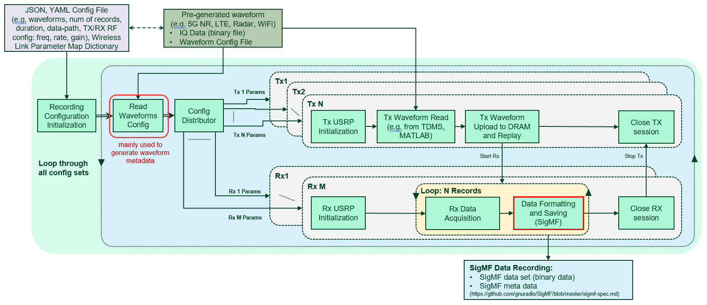
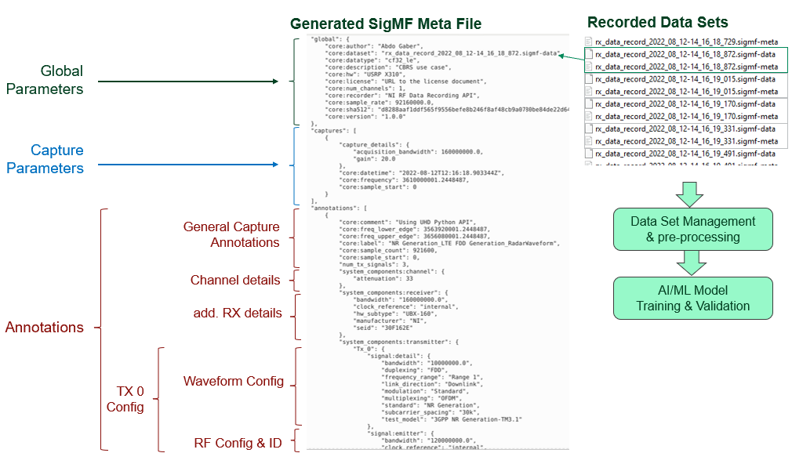

# NI RF Data Recording API v1.0.0

Welcome to RF Data Recording API! The RF Data Recording API is the free and open-source API to record Real-World Data and save it in [Signal Metadata Format (SigMF) format](https://github.com/gnuradio/SigMF). SigMF is an open-source standard that specifies a way to describe sets of recorded digital signal samples with metadata written in [JSON](http://www.json.org/) (portability, and readability). 

The RF Data Recording API has been built based on [UHD](https://github.com/EttusResearch/uhd). UHD is the free & open-source software driver and API for the [Universal Software Radio Peripheral (USRP™) SDR](https://www.ettus.com/products/) platform.

---

## Table of Contents
<!-- AUTO-GENERATED-CONTENT:START (TOC:collapse=true&collapseText="Click to expand") -->
<details>
<summary>"Click to expand"</summary>

- [NI RF Data Recording API](#ni-rf-data-recording-api-v100)
    - [Table of Contents](#table-of-contents)
    - [Introduction](#introduction)
    - [API Features](#api-features)
    - [System Requirements](#system-requirements)
        - [Software](#software)
        - [Hardware](#hardware)
    - [Reference Architecture](#reference-architecture)
    - [API Components](#api-components)
        - [Main Scripts for API Execution](#main-scripts-for-api-execution)
        - [Waveforms](#waveforms)
        - [Configuration Files](#configuration-files)
        - [Wireless Link Parameter Map Dictionary](#wireless-link-parameter-map-dictionary)
        - [API Library](#api-library)
    - [System Setup](#system-setup)
    - [How to Run NI RF Data Recording API](#how-to-run-ni-rf-data-recording-api)
		- [Running RF Data Recording API based on Configuration File](#running-rf-data-recording-api-based-on-configuration-file)
		- [RF Replay Data Transmitter](#rf-replay-data-transmitter)
		- [RF Rx Data Recorder](#rf-rx-data-recorder)
		- [LO Configuration](#lo-configuration)
		- [Results](#results)
		- [RF Data Pre-Processing](#rf-data-pre-processing)
	- [Directories](#directories)
    - [Contributing](#contributing)
    - [Known Issues and Limitations](#known-issues-and-limitations)

</details>
<!-- AUTO-GENERATED-CONTENT:END -->

---

## Introduction
Future wireless communications are expected to use more and more artificial intelligence and machine learning (AI/ML) principles. The AI/ML algorithms have to get trained to serve specific purposes. They require large data sets to get trained to a wide variety of potential scenarios and the performance depends on the quality and representability of the dataset. 

As a result, RF Datasets play pivotal role in training and testing AI/ML models for different wireless applications. However, researchers use different channel models and ray-tracing applications that generate datasets for a specific scenario to test and validate their AI/ML models.

It is quite difficult to generalize these AI/ML models and compare them, and to adopt these data sets by the broader research community. In addition, generating real-world data sets is also required for AI/ML algorithms training to be robustness in practical environments. 

The RF Data Recording API is designed by [NI](https://www.ni.com/) in collaboration with [Northeastern University](https://coe.northeastern.edu/) to generate real-world datasets and save it in SigMF format. The SigMF metadata is human readable and easy to parse (JSON-based metadata files). It provides a sufficient scenario description. This will simplify the management of dataset libraries and the adoption by other researchers.

---

## API Features
- Interface NI’s USRP SDR platform via UHD driver and Python software platforms.
- Facilitate hassle-free setup of NI’s SDR platform for experimentation and datasets collection.
- Highly configurable as it requires a single configuration file for setting the desired values of parameters of multiple connected SDRs for the required data recording campaign.
- [JSON](http://www.json.org/) Or [YAML](https://yaml.org/) based configuration of data recording campaign. 
- Scalable number of Tx and Rx stations with individual parameter configuration (e.g. frequency, bandwidths, Tx/Rx gains, Tx LO …).
- Definition of parameter settings as single, list or range of values.
- Continuous waveform playback for each Tx with individual waveforms in [TDMS](https://www.ni.com/en-ca/support/documentation/supplemental/06/the-ni-tdms-file-format.html) or MATLAB format (e.g.  5G NR, LTE, Radar, WiFi). 
- Configurable number of data recordings per configuration point.
- Instant conversion of recorded IQ data to [SigMF format](https://github.com/gnuradio/SigMF) proposed by OS group as standard for RF AI/ML datasets.
- SigMF metadata includes individual information of each active Tx and RF configuration.
- Several operation modes to use single or multiple host machines.

---

## System Requirements

### Software
Ubuntu 20.04 is used in our test environment. However, you can build UHD on different operating systems. Look to [Building and Installing the USRP Open-Source Toolchain (UHD and GNU Radio) on Linux - Ettus Knowledge Base](https://kb.ettus.com/Building_and_Installing_the_USRP_Open-Source_Toolchain_(UHD_and_GNU_Radio)_on_Linux).

### Hardware
To use the NI RF Data Recording API, you need at least one NI RF USRP device (for Tx or Rx only operation mode). The API has been tested only on [NI USRP X310](https://www.ettus.com/all-products/x310-kit/) ([X300/X310 Getting Started Guides](https://kb.ettus.com/X300/X310_Getting_Started_Guides)). The devices should be connected to single or different host computers based on the API operation mode and the investigated application. The following figure shows the setup of three Tx stations and one Rx Station.   


The following table presents the required hardware for this configuration (cabled setup).
| Item    					| Number	| 
| ------------------------- | ----------|
| Host PC (Linux Server)   	| 1 		|
| X310 USRP Device    		| 4    		| 
| SMA Cable  				| 4 		| 
| 30 dB Attenuator  		| 1    		| 
| 10 Gig Eth Cable (SFP+) *	| 4     	|
***Note**: The USRP X310 can be connect to the host machine using different options. Look to [Network Connectivity Guide](https://files.ettus.com/manual/page_usrp_x3x0.html).
- Host PC Linux server: Recommended with [10Gig Eth card (SFP+)](https://www.ettus.com/all-products/10gige-1m/).
- SMA cable: Female/female cable that is included with the USRP RIO device.
- USRP RIO device: USRP-X310, USRP-2940/2942/2943/2944/2950/2952/2953/2954 Software Defined Radio Reconfigurable Devices with 120 MHz or 160 MHz bandwidth and with UHD FPGA images.
- Attenuator with 30 dB attenuation and male/female SMA connectors that are included with the USRP RIO device.

Ensure your host has enough free disk space and RAM. 

- **Caution**: Before using your hardware, read all product documentation to ensure compliance with safety, EMC, and environmental regulations.
- **Caution**: To ensure the specified EMC performance, operate the RF devices only with shielded cables and accessories.
- **Caution**: To ensure the specified EMC performance, the length of all I/O cables except for those connected to the GPS antenna input of the USRP device must be no longer than 3 m (10 ft.).
- **Caution**: The USRP RIO RF devices are not approved or licensed for transmission over the air using an antenna. As a result, operating this product with an antenna may violate local laws. Ensure that you are in compliance with all local laws before operating this product with an antenna.

---

## Reference Architecture
By using a few clicks, the RF Data Recording API can generate real-world RF datasets using NI SDR platform at different configurations. Its flexible architecture allows for different recording use cases. Such as any system, the RF Data Recording API has the inputs, the processing unit, and the outputs. Those are:
- **Inputs**: They are three:
    - Configuration file in JSON or YAML format
    - Wireless Link Parameter Map Dictionary (YAML file)
    - Pre-generated waveforms (NR, LTE, Radar, WiFi)
- **Processing unit**: It has two parts:
    - SW: The RF data Recording API code on top of UHD Python API. 
    - HW: Linux Server and NI USRPs
- **Output**: The recorded RF dataset in SigMF format. For each record, there are two files:
    - SigMF Data: Binary file includes collected raw data
    - SigMF Meta-Data (JSON format)

The following figure shows the reference architecture of NI RF Data Recording API.


---

## API Components
The main components of the source project are described in the following:

---

### Main Scripts for API Execution
 The main scripts to execute the API are:
- **RF Data Recording API**:  The main Python script for Tx, Rx, or Tx & Rx RF modes is `src/main_rf_data_recording_api.py`. It is configured via configuration files stored in [src/config](src/config).

To run the API in Tx or Rx RF mode only and configure it from the terminal, the following two scripts can be used:
- **RF Replay Data Transmitter**: `src/rf_replay_data_transmitter_usrp_uhd.py`
- **RF Rx Data Recorder**: `src/rf_data_recorder_usrp_uhd.py`

---

### Waveforms
The waveforms folder [src/waveforms](src/waveforms) has several waveforms collected based on the related wireless standard in four subfolders for 5G NR, LTE, Radar, and WiFi. The formats of waveforms are:
- **[tdms](https://www.ni.com/en-ca/support/documentation/supplemental/06/the-ni-tdms-file-format.html)**: Several 5G NR and LTE standard compliant waveforms have been generated in advance using [NI RFmx Waveform generator](https://www.ni.com/de-de/shop/software/products/rfmx-nr.html)
- **matlab_ieee**:  The IEEE waveform generator is used to generate a waveform in MATLAB format.
- **matlab**: The Radar waveforms created by Northeastern University in MATLAB format.

Each waveform should have two files:
- Waveform Binary Data File
- Waveform Config File in YAML Format. For IEEE waveform generator, the configuration file is in CSV format.

Both files should have the same name and different format. 
- Example for a waveform in TDMS format: 
    - Waveform IQ data: `LTE_TDD_DL_20MHz_CC-1_E-UTRA_E-TM3.1a.tdms`
    - Waveform config file: `LTE_TDD_DL_20MHz_CC-1_E-UTRA_E-TM3.1a.rfws`
- Example for a waveform in MATLAB format: 
    - Waveform IQ data: `RadarWaveform_BW_2M.mat`
    - Waveform config file: `RadarWaveform_BW_2M.yaml`

---

### Configuration Files
The RF Data Recording API provides configuration files in [JSON](http://www.json.org/) or [YAML](https://yaml.org/) format. They are stored in [src/config](src/config) folder. It is worth mentioning that:
- JSON Config Files have a very compact configuration description, but parameters documentation is on the header of the file and far from the actual parameter's settings.
- YAML Config Files are not compact as JSON, but parameters documentation is close to the related parameter settings.

Each configuration file has the following sections:
- **Possible values**: Description for every parameter (ONLY for JSON configuration file).
- **General configuration**: List the basic parameters such as the path of recorded data, the number of records, description for the test case, … etc.
- **Transmitters configuration**: List of transmitters where every transmitter has a list of parameters that you can sweep over. The parameters are the RF configuration such as frequency, gain, sampling rate, antenna port, … etc, and selected waveform (waveform: path, name, and format). The sampling rate can be configured by the user or read from the related waveform configuration file. Three types of variations have been defined:
    - **Range**: The user needs to specify the start, stop, and step (i.e. in JSON):
`“Range_Param":{"SeqType": „range", "Values": ["start", "stop", "step“]}`
    - **List**: The user can list a set of parameters to sweep over (i.e. in JSON):
`“List_Param":{"SeqType": „list", "Values": ["x1", "x2", "x3", … , "xn"]}`
    - **Single**: The user can provide a single value of the parameter (i.e. in JSON):
`"Single_Param”:{"SeqType": „single", "Values":”waveform_path”}`
- **Common Tx Stations configuration**: A list of parameters that are related to transmitters for clock reference configuration and the waveform replay data configuration to have a continuous transmission.
- **Receivers configuration**: List of receivers where every Receiver has a list of parameters that you can sweep over. Those parameters are the RF configuration such as frequency, gain, sampling rate, antenna port, clock reference, … etc, and duration of record. The sampling rate can be configured by the user or given from the Tx configuration. If there are multiple transmitters with different sampling rates, the maximum value will be used. Three types of variations have been defined as it is mentioned above: “Range”, “List”, and “Single”.

**Note**: If there are multiple transmitters, the API can be configured to execute them either in parallel or in sequential while if there are multiple receivers, the default is to execute them in parallel. 

The following figure shows an exemplary of YAML/JSON RF data recording API configuration file.

 
Several configuration files have been created as a template for all operation modes: Tx and Rx mode, Tx or Rx only mode, and multi transmitters and receivers. 
- Mutli-Tx and Single Rx (JSON): [src/config/config_rf_data_recording_api.json](src/config/config_rf_data_recording_api.json)
- Mutli-Tx and Single Rx (YAML): [src/config/config_rf_data_recording_api.yaml](src/config/config_rf_data_recording_api.yaml)
- Mutli-Tx and Multi-Rx (JSON): [src/config/config_rf_data_recording_api_4TX_2RX_test.json](src/config/config_rf_data_recording_api_4TX_2RX_test.json)
- Rx Only:  [src/config/config_rf_data_recording_api_rx_only.yaml](src/config/config_rf_data_recording_api_rx_only.yaml)
- Tx Only: [src/config/config_rf_data_recording_api_tx_only.yaml](src/config/config_rf_data_recording_api_tx_only.yaml)

**Note**: For Tx only or Rx only, you can use the config file for this operation mode as it is mentioned in the configuration templates above or you can use the RF Replay Data Transmitter and RF Rx Data Recorder scripts by passing the configurations directly from the terminal.

---

### Wireless Link Parameter Map Dictionary
Since every waveform generator can create waveforms and related configuration with different naming scheme, the [src/config/wireless_link_parameter_map.yaml](src/config/wireless_link_parameter_map.yaml) is a dictionary to do the parameters pair between the waveform config and the SigMF metadata (e.g. RFWS parameter name vs. SigMF meta-data parameter name). It eases of adoption in case of adding new parameters, using different waveform creator with different naming scheme, or define your own customized waveform. To get those parameters in metadata, the required changes need to be done only in the parameter map dictionary. Some parameters are required for RF configuration also such as the sampling rate and bandwidth. 

The following figure shows an exemplary of Wireless Link Parameter Map Dictionary.


**Note**: The Wireless link parameter map dictionary is not used to get parameters from RFWS waveform config file due to the dependency between parameters; it requires hierarchical parameter extraction.

---

### API Library 
The RF Data Recording API library has several main components: 
- **Recording Configuration Interface**: It reads the configuration file in YAML or JSON format and creates the variation map by doing a cross product over all possible values. Each Tx and Rx has own list of parameters. The application settings are applied when the function starts and cannot be changed once the application is up and running. 
    - Python function: `src/lib/rf_data_recording_config_interface.py`
- **Read Waveform config interface**: For every iteration, the waveforms config is read first to be stored later in SigMF metadata or to configure the RF based on waveform specification. By using the [Wireless Link Parameter Map Dictionary](src/config/wireless_link_parameter_map.yaml), it does the parameter pairing between the waveform config and the SigMF metadata.
    - Python function: `src/lib/read_waveform_config_interface.py`
- **Config Distributor**: It is used to get the config of every Tx or Rx from the configuration vector. 
    - Python function: It is part of the API main class `src/lib/rf_data_recording_api_def.py`
- **Transmitters and Receivers Executors**: Different threads are created; each Tx or Rx station has own thread.
    - **Transmitters**:  The selected waveform data is going to be read via `src/lib/read_waveform_data_interface.py` and then uploaded to the USRP DRAM and start the waveform replay.
        - Python function: `src/lib/run_rf_replay_data_transmitter.py`
    - **Receivers**: The Rx sessions are generated and started simultaneously with transmitters. Data recording will start when the first Tx starts data transmission. The Rx data recording is executed for N records and for the given duration. 
        - Python function: `src/lib/run_rf_data_recorder.py`
- **Write Dataset to SigMF format**:  For each data recording, data formatting and saving in SigMF format is done. The recorded dataset is saved in two files: binary file for IQ data and a JSON file for the meta-data. 
    - Python function: `write_rx_recorded_data_in_sigmf.py`

---

## System Setup
Follow the Getting Started Guide instructions [docs/Getting Started Guide of NI RF Data Recording API.pdf](docs/Getting_Started_Guide_of_NI_RF_Data_Recording_API.pdf) to setup the hardware and software of the system. It includes:
- Build and Install UHD Python API
    - UHD Installation Test
    - UHD Python API – Test
- Increase Performance of Interface
- Install RF Data Recording API Support Packages
- Setup Networking
- Setup Hardware

---

## How to Run NI RF Data Recording API
After system setup, open the terminal and clone the repository. Then, switch to `src` folder.

---

### Running RF Data Recording API based on Configuration File
To run the main script using the default configuration file `config/config_rf_data_recording_api.json`, use the following command:

```
python3.9 main_rf_data_recording_api.py
```
Note: We built the system environment based on Python3.9. However, the default Python of Linux system can be used (minimum version 3.5).

The user can provide the configuration file to the API from the terminal:
```
python3.9 main_rf_data_recording_api.py –-config config/config_rf_data_recording_api.yaml
```
On the console, the API prints the varaition map and the configuration vector per each iteration. User can disable it via `enable_console_logging` parameter under `general_config` section in the configuration file. In addition, it prints the hardware info, number of Rx samples and the elapsed time of getting Rx samples and writing data and metadata files per each record. At the end of execution, the API prints the total size of Rx data on memory.
The following figure shows an exemplary of API console.


Several configuration files have been created as a template for all operation modes. Look to Section of [Configuration Files](#configuration-files).

Assume the user would like to transmit or receive data using several host machines. Use the Tx or Rx only configuration file as a template and create a configuration file with related parameters for each station. 
The API needs to be executed on each machine independently. The user can use also:
- For Tx only mode using a single station: The [RF Replay Data Transmitter](#rf-replay-data-transmitter)
- For Rx only mode using a single station: The [RF Rx Data Recorder](#rf-rx-data-recorder)

---

### RF Replay Data Transmitter
For Tx only using as a single station, the user can use also the RF Replay Data Transmitter. Assume you would like to replay the 5G NR waveform `NR_FR1_DL_FDD_SISO_BW-20MHz_CC-1_SCS-30kHz_Mod-64QAM_OFDM_TM3.1.tdms`, with the following parameters (frequency = 2 GHz, rate = 30.72 MS/s, gain = 30 dB, USRP IP = 192.168.40.2). Run the following command:

```
python3.9 rf_replay_data_transmitter_usrp_uhd.py  --args="type=x300,addr=192.168.40.2,master_clock_rate=184.32e6" --freq=2e9 --rate=30.72e6 --gain=30 --path="waveforms/nr/" --file="NR_FR1_DL_FDD_SISO_BW-20MHz_CC-1_SCS-30kHz_Mod-64QAM_OFDM_TM3.1" --waveform_format="tdms"
```

To stop data transmission, click on the terminal ctrl+c.

---

### RF Rx Data Recorder
Assume you would like to record the IQ data and save it in SigMF format to this path “/home/user/workarea/recorded-data”. The configuration parameters are (frequency = 2 GHz, rate = 30.72 MS/s, gain = 30 dB, channels =0, duration 10 ms, number of records 1, USRP IP = 192.168.40.2). Run the following command:

```
python3.9 rf_data_recorder_usrp_uhd.py --nrecords 1 --args="type=x300,addr=192.168.40.2,master_clock_rate=184.32e6" --freq 2e9 --rate 30.72e6 --duration 10e-3 --channels 0 --gain 30 --rx_recorded_data_path /home/user/workarea/recorded-data
```

Since the Rx is running independently from Tx and this Rx Data Recorder script is not configured via the configuration file, the user needs to update the metadata in this script manually. Go to the section of write data to SigMF files in the code to update metadata.

---

### LO Configuration
To mitigate the LO leakage/DC offset, the LO configuration can be used for that. It can be enabled or disabled via the configuration file. Those parametes are (i.e. in JSON file):
```
"lo_offset":      {"SeqType": "single",   "Values": 20.0e6},
"enable_lo_offset":{"SeqType": "single",  "Values": "True"},
```
The figure below shows the relationship between different frequencies in the configuration file and that on Tx and Rx RF:
- Configuration File:  Tx Target center frequency and Tx LO offset frequency 
- Tx RF: Tx LO frequency and location of band of interest shifted by LO offset from Tx LO frequency
- Rx RF: Rx Target center frequency

Note: $f_{LO-offset,Tx}$ can be given with negative sign. So, the $f_{LO,Tx} = f_{c,target}- |f_{LO-offset,Tx}|$.


 
The frequency of LO Offset should be within the following two boundaries:
- Larger than half of the signal bandwidth: $f_{LO-offset,Tx}>BW/2$
- Less than half of the deviation between the RF analog bandwidth (USRP daughterboard BW) and signal bandwidth: $f_{LO-offset,Tx}< (f_{RF-BW}-BW)/2$

The figure below shows the boundaries of LO offset.


---

### Results
The figure below shows an example of recorded datasets in SigMF format. The figure shows also how recorded datasets can be used in data set management and then in AI/ML model training and validation.  



---

### RF Data Pre-Processing
We created a simple example to read the SigMF metadata and visualize the recorded IQ data. The following script `src/rf_data_pre_processing_spectrogram.py` can be used to plot the spectrogram of recorded data. It requires two parameters:
- Path to dataset folder
- Dataset base filename (without SigMF file extension)

Assume three transmitters transmit the following signals (default configuration file `config_rf_data_recording_api.json`):
- 5G NR FR1 DL FDD wavefrom with 10 MHz bandwidth created based on 3GPP Release 15 [testmodel 3.1](https://www.etsi.org/deliver/etsi_ts/138100_138199/13814101/15.00.00_60/ts_13814101v150000p.pdf), Section 4.9.2.2.5, and 3.6 GHz carrier target frequency. 
- LTE DL FDD wavefrom with 10 MHz bandwidth created based on 3GPP Release 8 EUTRA2 [testmodel 2](https://www.etsi.org/deliver/etsi_ts/136100_136199/136141/08.03.00_60/ts_136141v080300p.pdf), Section 6.1.1.3, and 3.61 GHz carrier target frequency. 
- Radar waveform with 1.428 MHz bandiwth, 10 MHz sampling rate, and 3.62 GHz carrier target frequency. The lo_offset is enabled, where the freqeuncy of LO offset is 10 MHz.

The figure below shows the spectrogram of received 5G NR, LTE, and Radar signals. The Rx sampling rate is 92.16 MHz.
 
 

 **Note**:
 - The `src/rf_data_pre_processing_plot.py` can be used also to read the SigMF metadata and plot time domain and spectrum of recorded IQ data.
 - The `src/tests/test_read_tdms_file_spectrogram.py` can be used to plot the spectrogram of Tx Waveform in TDMS format.

---

## Directories
The following tree shows the RF Data Recording API repository structure:
``` RF Data Recording API
# main
  ├─ build  - # Contain all scripts related to build process
  ├─ docs   - # API Documentation
  │  ├─ Getting started guide to setup the system.pdf.
  │  └─ figures
  ├─ resources  - # For all static resources in the project. For example, images, i.e. spectrogram
  ├─ src/config - # Templates for all API Configurations and wireless link parameter map dictionary
  ├─ src/lib    - # RF Data Recording API library
  ├─ src/tests  - # Contains all tests (test API interfaces, plot spectrogram of Tx waveform, read SigMF metadata)
  ├─ src/waveforms  - # Contains all waveforms for 5G NR, LTE, Radar and WiFi
  │  ├─ main_rf_data_recording_api.py   - # Main Script to execute the API in all RF modes, configured via configuration files.
  │  ├─ rf_replay_data_transmitter_usrp_uhd.py  - # For Tx only, configured via terminal
  │  ├─ rf_data_recorder_usrp_uhd.py    - # For Rx only, configured via terminal 
  │  ├─ rf_data_pre_processing_plot.py  - # Read SigMF metadata and plot time domain and spectrum of recorded IQ data
  │  └─ rf_data_pre_processing_spectrogram.py   - # Read SigMF metadata and plot spectrogram of recorded IQ data
  ├─ tools  - # Contain scripts to automate tasks in the project
  ├─ README.md
  └─ License.md - # MIT License
  ```

---

## Contributing
The users and developers can contribute by adding more features or optimize the code. However, they should follow the following procedure:
- Create a branch for the new feature.
- Test API code after your changes.
- Create a Pull Request. Your Pull Request should have the following info:
    - **Summary**: Briefly summarize your changes and the motivation behind them in one or two sentences.
    - **Detailed Description**: Provide information about the nature of your changes.
    - **Affected Components**: List the core components of the system that are affected by your changes.
    - **Additional Testing/Validation**: Please specify whether there were additional (manual) tests done. Please also specify the configurations/systems used to run these tests.
    - **Checklist**: 
        - [ ] Revert Scripts without functional changes.
        - [ ] (Python) Reformat your code using Black.
        - [ ] Document your code.
        - [ ] Remove all debug code.
        - [ ] Functional changes are tested.
- Your request needs to be approved by NI
- If your Pull Request is accepted, it can be merged then to the main branch.

---

## Known Issues and Limitations
-	Tested on X310 USRP only
